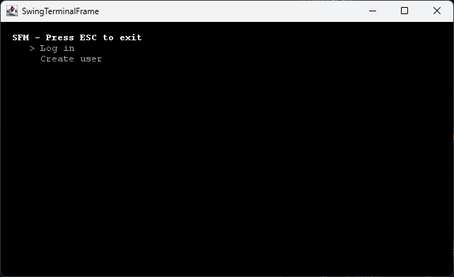
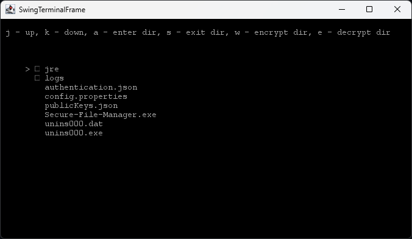

# Secure-File-Manager
A directory encryption software for Windows. 

# Features
## Authentication

Allows only authenticated users to access the services. Fulfilled through locally-stored files that contain encrypted and hashed user authentication information.

## Directory Encryption

A fully-functional directory tree browser that allows you to encrypt/decrypt entire directories. Recursively processes subfolders.

Security is provided through the user of a mix of symmetric and asymmetric encryption, where only the intended recipient can open the encrypted vault. 

## Digital Signatures
Non-repudiation guaranteed through the user of digital signatures, which ensures the recipient the vault comes from a known source.
